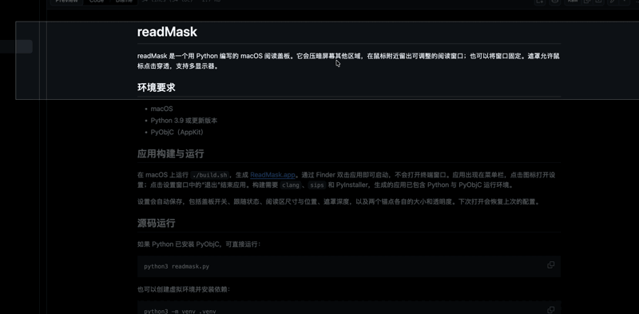

# readMask

readMask 是一个用 Python 编写的 macOS 阅读盖板。它会压暗屏幕其他区域，在鼠标附近留出可调整的阅读窗口；也可以将窗口固定。遮罩允许鼠标点击穿透，支持多显示器。

## 效果演示

跟随鼠标时，阅读区会随鼠标移动：



## 环境要求

- macOS
- Python 3.9 或更新版本
- PyObjC（AppKit）

## 应用构建与运行

在 macOS 上运行 `./build.sh`，生成 [ReadMask.app](dist/ReadMask.app)。通过 Finder 双击应用即可启动，不会打开终端窗口。应用会显示在程序坞和菜单栏，点击任一图标可打开设置；点击设置窗口中的“退出”结束应用。构建需要 `clang`、`sips` 和 PyInstaller，生成的应用已包含 Python 与 PyObjC 运行环境。

设置会自动保存，包括盖板开关、跟随状态、阅读区尺寸与位置、遮罩深度，以及两个锚点各自的大小和透明度。下次打开会恢复上次的配置。

## 源码运行

如果 Python 已安装 PyObjC，可直接运行：

```sh
python3 readmask.py
```

也可以创建虚拟环境并安装依赖：

```sh
python3 -m venv .venv
source .venv/bin/activate
python3 -m pip install -r requirements.txt
python3 readmask.py
```

本机的 macOS 系统 Python 若已包含 PyObjC，也可使用 `/usr/bin/python3 readmask.py`。

启动后，点击菜单栏中的阅读图标打开设置窗口。可以在设置中开关盖板、切换鼠标跟随、移动固定阅读区，以及调整阅读区宽高和遮罩深度。点击窗口底部的“退出”结束程序；关闭设置窗口不会退出。

## 快捷键

| 快捷键 | 功能 |
| --- | --- |
| `⌃⌥⌘[` | 开关盖板 |
| `⌃⌥⌘]` | 切换跟随鼠标 |
| `⌃⌥⌘\` | 将阅读区移到鼠标位置 |

`⌃`、`⌥`、`⌘` 分别代表 Control、Option、Command。快捷键也显示在设置窗口中。如果组合键已被其他应用占用，程序可能无法注册并启动。

关闭“跟随鼠标”后，亮区右下角带对角双箭头的圆形锚点可拖动调整宽高；亮区下方、约 60% 宽度处带鼠标指针和四向箭头的长椭圆锚点可拖动整块亮区，支持跨显示器移动。移动锚点默认 120×48 pt，缩放锚点默认 24×24 pt。空闲时默认透明度为 90%，悬停时完全显示；遮罩深度默认 50%。设置中可分别调整两个锚点的大小和透明度；跟随模式下仍可用设置滑块调整阅读区尺寸。

固定模式下，阅读区下方还会显示从浅到深渐变的遮罩深度滑块，与设置窗口中的滑块同步，范围为 0% 到 100%。阅读区宽度和高度均按所在屏幕的百分比调整。

## 开发检查

在 macOS 图形会话中运行 `python3 readmask.py --smoke`，程序会检查遮罩、锚点和快捷键的基本状态，然后自动退出。
